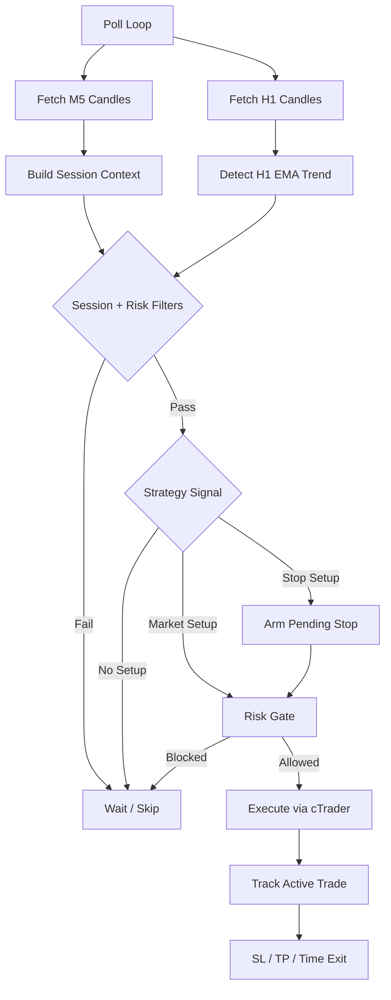

# Forex Scalping Bot — IC Markets Edition
Rule-based forex scalping bot using IC Markets cTrader Open API

---

## ⚙️ How it Works

The bot operates as a **semi-autonomous polling system** that combines multi-timeframe technical filters, position sizing, and cTrader execution.

### Architecture Overview



1. **Multi-timeframe data (`index.js`, `icmarkets.js`)**:
   The live bot fetches closed **M5** candles for entries and **H1** candles for higher-timeframe context.

2. **Current primary strategy (`indicators.js`)**:
   The default mode is `ny_asian_continuation`, which looks for the first clean New York break of the Asian range with optional H1 trend alignment.

3. **Risk management (`risk-manager.js`, `position-sizing.js`)**:
   Position size is calculated from configured account capital, risk percentage, SL distance, pip value, leverage cap, and max position size.

4. **Execution and persistence**:
   The bot sends cTrader market orders, reconciles existing positions on startup, writes active trade state to `state.json`, and tracks daily risk state in `risk-state.json`.

---

## 🚀 Roadmap: Areas for Improvement

Based on our recent backtests and live execution analysis, here are the primary points we can improve:

### 1. Execution Speed & Latency
- **Optimized Indicators**: Currently, we recalculate all indicators on every tick. Moving to a more efficient sliding-window approach or using a dedicated library like `technicalindicators` for performance.
- **Broker/API Latency**: Order placement and candle refreshes depend on cTrader API response times. Rate-limit handling and request batching remain important optimization areas.

### 2. Advanced Market Context
- **News and macro filters**: Add optional high-impact news/calendar guards before automation.
- **Correlated Pairs**: Monitoring `DXY` (Dollar Index) or `GBPUSD` to detect broader USD strength/weakness, which often precedes `EURUSD` movement.

### 3. Backtest Realism
- **Slippage Simulation**: Current backtests assume perfect execution. Adding `0.2 - 0.5 pip` slippage would make the results more conservative and realistic.
- **Variable Spread**: Simulating spread widening during news releases or session rollovers to test the bot's resilience during high-volatility periods.

### 4. Scalability & Monitoring
- **Broader Pair Coverage**: The current loop already supports multiple configured pairs; the next step is validating which pairs improve portfolio-level expectancy.
- **Web Dashboard**: A real-time web UI (e.g., using Next.js or a simple dashboard) to monitor active trades, P&L, risk state, and strategy reasons without tailing log files.

### 5. Data Persistence & Analytics
- **Database Migration**: Moving `history_*.json` and trade logs to a database (e.g., SQLite or PostgreSQL) for faster querying and better long-term performance tracking.
- **Post-Trade Analysis**: Automatically tagging trades with strategy reason and outcome to identify which market conditions the bot excels in.

---

## Full Setup Guide (do these in order)

### Step 1 — Create a cTrader ID
1. Go to **https://id.ctrader.com** and sign up
2. This is separate from your IC Markets login — it's Spotware's universal ID

### Step 2 — Link IC Markets to your cTrader ID
1. Go to **https://ct.icmarkets.com** (IC Markets cTrader web platform)
2. Log in using your cTrader ID
3. Your IC Markets trading account should appear automatically
4. Note your **account number** (top-left dropdown, 8–9 digits)

### Step 3 — Register an Open API Application
1. Go to **https://openapi.ctrader.com**
2. Log in with your cTrader ID
3. Click **Add new app**
4. Fill in a name (e.g. "Scalping Bot") and description
5. Submit — approval usually takes a few minutes
6. Once approved, click **Credentials** and copy:
   - **Client ID**
   - **Client Secret**

### Step 4 — Install dependencies
```bash
npm install
```

### Step 5 — Set environment variables
Create a `.env` file:
```
# IC Markets Credentials
CTRADER_CLIENT_ID=your-client-id
CTRADER_CLIENT_SECRET=your-client-secret
CTRADER_ACCOUNT_ID=your-ic-markets-account-number
```

### Step 6 — Get your Access Token (one-time)
```bash
node auth.js
```
- A URL is printed → open it in your browser
- Log in with your cTrader ID and click Allow
- The token is printed in your terminal
- Add it to your `.env`:
```
CTRADER_ACCESS_TOKEN=your-access-token
```

### Step 7 — Get your Symbol IDs
```bash
node get-symbols.js
```
- Prints the correct symbol IDs for your IC Markets account
- Copy the output block into `config.js` → `ctraderSymbolIds`

### Step 8 — Download historical data for backtests
```bash
npm run download
```

For a longer EUR/USD dataset:
```bash
npm run download:eurusd:3y
```

### Step 9 — Run the bot
```bash
# Monitor only — signals printed, no trades placed (START HERE)
npm start

# Auto-execute using current configured trading pairs and strategy
npm run auto

# Current primary strategy profile
npm run start:ny-asian
npm run auto:ny-asian

# Backtest current strategy
npm run backtest:ny-asian

# Analyze latest backtest and regenerate report.html
npm run analyze
```

---

## 📊 Safety & Performance Features

| Feature | Benefit |
|---|---|
| **Session Filters** | Only evaluates trades during configured London/NY UTC windows. |
| **Hard HTF Filter** | Requires H1 trend alignment when enabled. |
| **Single-Trade Focus** | Defaults to one total trade and one trade per pair. |
| **Slippage Guard** | Sends cTrader slippage protection using `MAX_SLIPPAGE_PIPS`. |
| **Reconciliation** | Bot automatically "finds" and manages trades after a restart. |
| **Dynamic Pip Value** | Professional risk calculation (1% risk) across any symbol. |

---

## Session Hours (when the bot trades)

| Session | UTC Hours | Quality |
|---|---|---|
| Default mode (`ny_only`) | 12:30–16:00 | ⭐ Best quality so far |
| Quality mode (`ny_quality`) | 12:30–16:00 | 🧪 Same NY window, named profile for A/B testing |
| Experimental (`ny_trimmed`) | 12:45–15:45 | 🧪 Slight edge trim for A/B testing |
| Alt mode (`all_windows`) | 07:00–10:00 + 12:30–16:00 | ✅ Higher trade count |
| Off hours | all other UTC times | ⚠️ Skipped |

Set mode with environment variable:
```bash
SESSION_WINDOW_MODE=ny_only npm run backtest
SESSION_WINDOW_MODE=ny_quality npm run backtest
SESSION_WINDOW_MODE=ny_trimmed npm run backtest
SESSION_WINDOW_MODE=all_windows npm run backtest
```

Fine-tune risk-band filters:
```bash
NY_ASIAN_MIN_RISK_PIPS=5 NY_ASIAN_MAX_RISK_PIPS=10 npm run backtest:ny-asian
```

Current defaults keep NY Asian continuation setups between 5 and 10 pips of stop risk
to skip both noisy tiny stops and wider-stop setups that tend to block cleaner follow-up trades.

Post-loss cooldown (default: 1 candle):
```bash
COOLDOWN_CANDLES_AFTER_LOSS=1 npm run backtest:ny-asian
COOLDOWN_CANDLES_AFTER_LOSS=0 npm run backtest:ny-asian
```

Current default is a 1-candle cooldown after an `SL`, which tested better than both
no cooldown and a 2-candle cooldown in the current backtests.

---

## File Overview

| File | Purpose |
|---|---|
| `index.js` | Main loop — signal + execution |
| `icmarkets.js` | cTrader WebSocket API client |
| `indicators.js` | NY Asian continuation signal logic and H1 EMA trend helper |
| `config.js` | Risk, session, strategy, and cTrader settings |
| `state.json` | Persistent storage for active trades |
| `risk-state.json` | Persistent storage for daily risk limits |

---

## ⚠️ Risk Warnings
- Always start on a **Demo** account for at least 48 hours.
- Default risk: **1% per trade** — do not increase.
- Token expires every ~30 days — re-run `node auth.js`.
- Scalping is high-risk — most retail traders lose money.
- This bot is experimental and provided for educational purposes.

## Trading Time:
| SessionWindow | Time                           |
|---------------|--------------------------------|
| London open   | 10:00–13:00 EAT                | 
| NY overlap    | 15:30–19:00 EAT                |
---