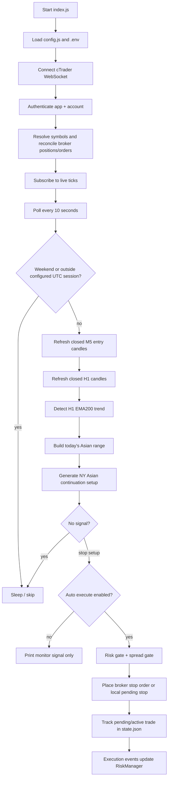

# IC Markets cTrader Scalping Bot

Rule-based forex scalping bot for IC Markets via the cTrader Open API. The current implementation runs one active strategy, `ny_asian_continuation`, on M5 candles with H1 EMA trend context, KES-denominated risk controls, optional live auto-execution, historical backtesting, and HTML reporting.

> **Risk notice:** This is experimental trading software. Start in `demo`, run in monitor-only mode first, and do not deploy with real funds unless you understand the strategy, execution risks, API behavior, and all configuration values.

---

## What this project contains

| Area | Files |
|---|---|
| Live bot loop | `index.js` |
| cTrader Open API client | `icmarkets.js`, `OpenApi*.proto` |
| Strategy and indicators | `indicators.js` |
| Runtime configuration | `config.js` |
| Risk and position sizing | `risk-manager.js`, `position-sizing.js` |
| OAuth token helper | `auth.js` |
| Symbol lookup helper | `get-symbols.js` |
| Historical data download | `download-history.js` |
| Backtesting | `backtest-multi.js`, `history_*.json` |
| Analysis and reporting | `trade-analyzer.js`, `generate-report.js`, `report-metrics.js` |
| Process/deployment | `ecosystem.config.cjs`, `Dockerfile` |
| Tests | `tests/` |
| Runtime state | `state.json`, `risk-state.json`, `activity.log`, `logs/` |

Runtime/generated files such as `.env`, `state.json`, `risk-state.json`, `history_*.json`, `trades_backtest.json`, `report.html`, logs, and `node_modules/` are ignored by git.

---

## Runtime architecture



### Live mode behavior

`index.js` is the main process.

1. Loads environment variables through `config.js` using `dotenv/config`.
2. Creates an `ICMarketsClient` and a `RiskManager`.
3. Connects to cTrader:
   - `demo.ctraderapi.com:5035` when `CTRADER_ENV=demo` or unset.
   - `live.ctraderapi.com:5035` when `CTRADER_ENV=live`.
4. Authenticates with:
   - `CTRADER_CLIENT_ID`
   - `CTRADER_CLIENT_SECRET`
   - `CTRADER_ACCESS_TOKEN`
   - `CTRADER_ACCOUNT_ID`
5. For every configured pair in `TRADING_PAIRS`, it:
   - fetches/validates broker symbol details where possible,
   - reconciles existing broker positions and pending orders,
   - subscribes to live tick events.
6. Starts a 10-second poll loop.
7. During configured session windows, it refreshes closed M5 and H1 candles, runs the strategy, and either logs signals or executes them depending on `--auto-execute`.

### Monitor-only vs auto-execute

| Mode | Command | Places orders? | Use case |
|---|---|---:|---|
| Monitor only | `npm start` | No | Safest first run. Connects, authenticates, subscribes, prints status/signals. |
| Auto execute | `npm run auto` | Yes for NY; London only if explicitly enabled | Runs NY auto-execution plus the cleaned London monitor profile in one process. |
| NY Asian monitor profile | `npm run start:ny-asian` | No | Same strategy with explicit environment overrides. |
| NY Asian auto profile | `npm run auto:ny-asian` | Yes | PM2/Docker-style live execution profile. |

---

## Current strategy modes

Supported `STRATEGY_MODE` values in `config.js` are:

```bash
STRATEGY_MODE=ny_asian_continuation
STRATEGY_MODE=london_asian_fake_break_reversal
STRATEGY_MODE=combined_ny_london
```

`ny_asian_continuation` is the current live-capable strategy. Its implementation lives in `indicators.js` and is called by both `index.js` and `backtest-multi.js`.

`indicators.js` also contains a tested London fake-break generator, `generateLondonAsianFakeBreakReversalSignal()`, for the proposed London module. It is wired into **backtesting only** through `STRATEGY_MODE=london_asian_fake_break_reversal`; live execution in `index.js` intentionally blocks this mode until a later monitor/live phase.

`combined_ny_london` runs both live routers in the same process so account reconciliation, risk gates, trade slots, and local state stay shared. London remains monitor-only unless `LONDON_LIVE_EXECUTION_ENABLED=true` is explicitly set.

### Strategy logic

1. Build the Asian range from M5 candles between `NY_ASIAN_START_UTC` and `NY_ASIAN_END_UTC`.
   - Defaults: `00:00–07:00 UTC`.
2. Trade only during the NY continuation window.
   - Defaults: `12:30–15:30 UTC`.
   - The current preferred-time filter waits until `13:00 UTC` by default.
3. Require the first clean NY break of the Asian high or low.
   - Default minimum break: `3.0` pips.
4. Optionally require H1 alignment.
   - Default: enabled.
   - BUY requires H1 `bull`; SELL requires H1 `bear`.
5. H1 trend is detected using closed H1 candles:
   - close above rising EMA200 = `bull`,
   - close below falling EMA200 = `bear`,
   - otherwise `neutral`.
6. Generate a stop-entry setup:
   - `buy_stop` above Asian high, or
   - `sell_stop` below Asian low.
7. Validate stop distance.
   - Default min risk: `5` pips.
   - Default max risk: `12` pips in `config.js`.
   - PM2 overrides this to `10` pips in `ecosystem.config.cjs`.
8. Set reward using `NY_ASIAN_RR_RATIO`.
   - Default: `1.2R`.
9. Expire pending entries after `NY_ASIAN_PENDING_EXPIRY_BARS` M5 bars.
   - Default: `3` bars.
10. Close active trades by:
    - broker SL/TP,
    - time exit after `NY_ASIAN_TIME_EXIT_BARS`, default `12`, or
    - force exit after `NY_ASIAN_FORCE_EXIT_UTC`, default `16:00 UTC`.

---

## Session windows

Session windows are configured in `config.js` using `SESSION_WINDOW_MODE`.

| Mode | UTC windows | Notes |
|---|---|---|
| `ny_only` | `12:30–16:00` | NY overlap only. |
| `ny_quality` | `12:30–16:00` | Same window, alternate profile name for testing. |
| `ny_trimmed` | `12:45–15:45` | Slightly narrower NY window. |
| `london_only` | `07:00–10:00` | London open only. Used by London fake-break backtests. |
| `all_windows` | `07:00–10:00`, `12:30–16:00` | Default in `config.js`; strategy defaults still allow `ny_overlap` only. |

Important distinction:

- `SESSION_WINDOW_MODE` controls when the bot wakes up and evaluates pairs.
- Strategy-specific allowed-session variables such as `NY_ASIAN_ALLOWED_SESSIONS` and `LONDON_FAKE_BREAK_ALLOWED_SESSIONS` control whether a strategy is allowed to trade in a named active window.
- By default, `NY_ASIAN_ALLOWED_SESSIONS=ny_overlap`, so London evaluations do not become London trades unless you explicitly change that strategy setting.

---

## Risk model and execution guards

Risk is managed by `risk-manager.js` and `position-sizing.js`.

### Defaults from `config.js`

| Setting | Default | Meaning |
|---|---:|---|
| `accountCapitalKES` | `250000` | Sizing reference capital in KES. |
| `RISK_PER_TRADE_PERCENT` | `0.5` | Risk percent per trade. |
| `ENFORCE_DAILY_STOP_LOSS` | `true` | Disable trading after daily realized loss threshold. |
| `DAILY_STOP_LOSS_KES` | `3000` | Daily realized loss gate. |
| `DAILY_PROFIT_TARGET_KES` | `5000` | Daily realized profit gate. |
| `maxLeverage` | `100` | Position sizing cap. |
| `usdKesRate` | `129.0` | Conversion rate used for KES sizing/reporting. |
| `MAX_TOTAL_TRADES` | `3` | Account-level active + pending slot cap. |
| `MAX_TRADES_PER_PAIR` | `1` | Pair-level active trade cap. |
| `maxPositionSizeUnits` | `100000` | Absolute unit cap. |
| `MAX_SLIPPAGE_PIPS` | `0.5` | cTrader market-order slippage setting. |
| `MAX_SPREAD_PIPS` | `1.5` | Live spread gate before execution. |
| `MAX_QUOTE_AGE_MS` | `5000` | Live quote freshness requirement. |

Position sizing formula:

```text
risk amount KES = accountCapitalKES × riskPerTradePercent / 100
units = risk amount KES / (stop loss pips × pip value per unit in KES)
```

Then units are capped by leverage and `maxPositionSizeUnits`.

### Runtime state files

| File | Written by | Purpose |
|---|---|---|
| `state.json` | `index.js` | Active trades and pending orders, so restarts can reconcile/adopt existing broker state. |
| `risk-state.json` | `risk-manager.js` | Daily realized P&L, daily risk gates, open trade count, intra-day trade log. |
| `activity.log` | `icmarkets.js` | Connection health alerts. |
| `logs/out.log`, `logs/err.log` | PM2 | PM2 stdout/stderr when using `ecosystem.config.cjs`. |

`risk-state.json` resets daily counters when the UTC day changes.

---

## Prerequisites

- Node.js 20+ recommended. The Docker image uses `node:20-slim`.
- npm or pnpm.
- IC Markets cTrader account linked to a cTrader ID.
- cTrader Open API application credentials.
- A cTrader Open API access token.

Install dependencies:

```bash
npm install
```

or, if you prefer the existing lockfile workflow:

```bash
pnpm install --frozen-lockfile
```

---

## Environment setup

Create `.env` from `.env.example`:

```bash
cp .env.example .env
```

Required values:

```bash
CTRADER_CLIENT_ID=your-client-id
CTRADER_CLIENT_SECRET=your-client-secret
CTRADER_ACCOUNT_ID=your-ctrader-account-id
CTRADER_ACCESS_TOKEN=your-access-token
CTRADER_ENV=demo
```

Recommended defaults for first runs:

```bash
CTRADER_ENV=demo
TRADING_PAIRS=EUR_USD,GBP_USD,USD_JPY
SESSION_WINDOW_MODE=all_windows
STRATEGY_MODE=ny_asian_continuation
RISK_PER_TRADE_PERCENT=0.5
```

Never commit `.env`; it is ignored by `.gitignore`.

---

## cTrader setup flow

### 1. Create and link your cTrader ID

1. Create/login to a cTrader ID at `https://id.ctrader.com`.
2. Log in to IC Markets cTrader web at `https://ct.icmarkets.com`.
3. Confirm your trading account is visible.
4. Note your cTrader account ID/account number for `CTRADER_ACCOUNT_ID`.

### 2. Register a cTrader Open API app

1. Go to `https://openapi.ctrader.com`.
2. Add a new application.
3. Use this redirect URI because `auth.js` listens locally on port `3000`:

```text
http://localhost:3000/callback
```

4. Copy the client ID and client secret into `.env`.

### 3. Generate an access token

Run:

```bash
npm run auth
```

What happens:

1. `auth.js` prints an authorization URL.
2. Open it in your browser.
3. Approve access.
4. Browser redirects to `http://localhost:3000/callback`.
5. The script exchanges the code for tokens.
6. Copy the printed value into `.env`:

```bash
CTRADER_ACCESS_TOKEN=printed-access-token
```

The script also prints `CTRADER_REFRESH_TOKEN`; the current bot reads `CTRADER_ACCESS_TOKEN` only, so re-run `npm run auth` when the access token expires.

### 4. Confirm symbol IDs

Run:

```bash
npm run symbols
```

Copy the printed `ctraderSymbolIds` block into `config.js` if your broker account returns IDs that differ from the current defaults.

---

## Running the bot

### Monitor-only first

```bash
npm start
```

This connects to cTrader, authenticates, reconciles account state, subscribes to ticks, and logs strategy status. It does not place trades.

### Auto-execute

```bash
npm run auto
```

`npm run auto` uses `STRATEGY_MODE=combined_ny_london` with the NY strategy live-capable and the cleaned London profile enabled for observation:

```bash
STRATEGY_MODE=combined_ny_london SESSION_WINDOW_MODE=all_windows \
LONDON_MONITOR_ENABLED=true \
LONDON_FAKE_BREAK_TRADE_END_UTC=9 \
LONDON_FAKE_BREAK_ALLOWED_WEEKDAYS=Wed \
LONDON_FAKE_BREAK_ALLOWED_PAIRS=EUR_USD,USD_JPY \
LONDON_MAX_LOSSES_PER_DAY=1 \
node index.js --auto-execute
```

Auto-execute can place broker stop orders or market orders when the strategy, risk, session, quote, and spread gates pass. London signals are logged but not placed unless `LONDON_LIVE_EXECUTION_ENABLED=true` is set.

### Useful live overrides

```bash
TRADING_PAIRS=EUR_USD npm start
```

```bash
MAX_TOTAL_TRADES=1 MAX_TRADES_PER_PAIR=1 npm run auto
```

```bash
MAX_SPREAD_PIPS=1.0 MAX_QUOTE_AGE_MS=3000 npm run auto
```

```bash
NY_ASIAN_REQUIRE_H1_ALIGNMENT=false npm run backtest:ny-asian
```

---

## Historical data and backtesting

Historical files are named:

```text
history_<PAIR>.json
```

Examples:

```text
history_EUR_USD.json
history_GBP_USD.json
history_USD_JPY.json
```

### Download history

Default download uses configured `TRADING_PAIRS`, M5 granularity, and 30 days:

```bash
npm run download
```

Download specific pairs/days:

```bash
node download-history.js --pair EUR_USD,GBP_USD --days 180 --resume --chunk-size 2500
```

Long EUR/USD helper:

```bash
npm run download:eurusd:3y
```

### Run a backtest

```bash
npm run backtest
```

NY Asian profile:

```bash
npm run backtest:ny-asian
```

Multi-pair NY Asian profile:

```bash
npm run backtest:ny-asian:multi
```

London fake-break research/backtest profile:

```bash
npm run backtest:london-fake-break
npm run backtest:london-fake-break:multi
npm run backtest:london-fake-break:usdjpy
npm run backtest:london-fake-break:eurusd-usdjpy
npm run backtest:london-fake-break:usdjpy:braked
npm run backtest:london-fake-break:eurusd-usdjpy:braked
npm run backtest:london-fake-break:usdjpy:cleaned
npm run backtest:london-fake-break:eurusd-usdjpy:cleaned
```

The default London mode tests Candidate B from `LONDON_FAKE_BREAK_IMPLEMENTATION_PLAN.md`:

- London `07:00–10:00 UTC`
- Tue/Wed/Thu only
- 4-pip minimum Asian-range break
- close back inside within 2 M5 bars
- 5–10 pip risk band
- stop beyond fake-break extreme
- TP at the opposite side of the Asian range
- 12-bar time-exit fallback

Candidate A time-exit scripts are also available for comparison:

```bash
npm run backtest:london-fake-break:a:multi
npm run backtest:london-fake-break:a:usdjpy
npm run backtest:london-fake-break:a:eurusd-usdjpy
```

Candidate A uses the strongest cross-pair research row:

- 2-pip minimum break
- close back inside within 3 M5 bars
- 5–10 pip risk band
- Tue/Wed/Thu only
- H1 reversal-aligned / break-counter-H1 filter
- time-exit target model

Both London profiles are not live-enabled yet.

Phase 5 monitor-only London observation can be started with:

```bash
npm run start:london-monitor:cleaned
```

This uses the cleaned research profile:

```text
TRADING_PAIRS=EUR_USD,USD_JPY
SESSION_WINDOW_MODE=london_only
LONDON_MONITOR_ENABLED=true
LONDON_FAKE_BREAK_TRADE_END_UTC=9
LONDON_FAKE_BREAK_ALLOWED_WEEKDAYS=Wed
LONDON_MAX_LOSSES_PER_DAY=1
```

London live execution is still disabled unless `LONDON_LIVE_EXECUTION_ENABLED=true` is explicitly set; keep it `false` during Phase 5.

Current Phase 3 comparison read:

- Candidate B is stronger than Candidate A in full backtests.
- Best London-only result so far is Candidate B on `USD_JPY` only.
- Candidate B on `EUR_USD,USD_JPY` is positive but `EUR_USD` is much weaker than `USD_JPY`.
- Candidate A time-exit did not survive full backtesting well and should stay research-only for now.
- If prioritizing total portfolio net, the current London candidate is Candidate B on `EUR_USD,USD_JPY` with `LONDON_MAX_LOSSES_PER_DAY=1`.
- Diagnostics found `09:00–10:00 UTC` and `EUR_USD` Thursdays were damaging. The latest cleaned backtest also found Tuesday and Thursday weak overall, so `backtest:london-fake-break:eurusd-usdjpy:cleaned` now keeps Candidate B on `EUR_USD,USD_JPY` with `LONDON_FAKE_BREAK_TRADE_END_UTC=9`, `LONDON_FAKE_BREAK_ALLOWED_WEEKDAYS=Wed`, and `LONDON_MAX_LOSSES_PER_DAY=1`.

The backtester:

- loads local `history_*.json` files,
- builds H1 candles from M5 data for EMA200 filtering,
- simulates spread and slippage using `BACKTEST_SPREAD_PIPS` and `BACKTEST_SLIPPAGE_PIPS`,
- applies KES daily risk gates,
- writes `trades_backtest.json`.

Default simulation costs:

```bash
BACKTEST_SPREAD_PIPS=0.7
BACKTEST_SLIPPAGE_PIPS=0.3
```

### Analyze and generate HTML report

```bash
npm run analyze
```

This runs:

```bash
node trade-analyzer.js && node generate-report.js
```

Outputs:

- terminal daily performance and robustness summaries,
- `report.html` dashboard.

Open the generated report in your browser:

```bash
open report.html
```

---

## Market-regime research helper

`market-regime-analysis.js` reads a local history file and prints exploratory regime/session statistics.

Example:

```bash
npm run research:regimes -- --pair EUR_USD --file history_EUR_USD.json --cost-pips 0.7
```

Phase 1 London fake-break research uses the same runner with additional fake-break tables:

```bash
npm run research:london-fake-break -- --pair EUR_USD --file history_EUR_USD.json --cost-pips 0.7
```

Useful research parameters:

```bash
npm run research:london-fake-break -- \
  --pair GBP_USD \
  --file history_GBP_USD.json \
  --fake-break-min-break-pips 2 \
  --fake-break-confirm-bars 2 \
  --fake-break-lookahead-bars 12 \
  --fake-break-stop-buffer-pips 0.5
```

Filter-sweep mode ranks combinations before any strategy implementation:

```bash
npm run research:london-fake-break:sweep -- \
  --pair EUR_USD \
  --file history_EUR_USD.json \
  --cost-pips 0.7 \
  --min-obs 80 \
  --sweep-top 20
```

Sweep dimensions can be overridden with comma-separated values:

```bash
npm run research:london-fake-break:sweep -- \
  --pair EUR_USD \
  --file history_EUR_USD.json \
  --sweep-min-break-pips 2,3,4,5 \
  --sweep-confirm-bars 0,1,2,3 \
  --sweep-risk-bands all,4-8,5-10,6-12,8-15 \
  --sweep-weekdays all,TueWedThu,Mon,Tue,Wed,Thu,Fri \
  --sweep-h1 all,break_with_h1,reversal_with_h1,break_counter_h1,reversal_counter_h1 \
  --sweep-directions all,up,down \
  --sweep-targets time_exit,asian_midpoint,rr_1_0,rr_1_2,asian_opposite
```

Compare sweep rows across multiple pairs and rank only filter sets that appear on every pair:

```bash
npm run research:london-fake-break:compare -- \
  --pairs EUR_USD,GBP_USD,USD_JPY \
  --cost-pips 0.7 \
  --min-obs 80 \
  --top 20
```

Any `--sweep-*` option can be passed through to the comparison runner. For example, to compare only fixed/level-based target models:

```bash
npm run research:london-fake-break:compare -- \
  --pairs EUR_USD,GBP_USD,USD_JPY \
  --cost-pips 0.7 \
  --min-obs 80 \
  --top 10 \
  --sweep-targets asian_midpoint,rr_1_0,rr_1_2,asian_opposite
```

Compare London Candidate B against the current NY module at day level:

```bash
npm run research:london-ny:correlation
```

This runs NY-only plus London `USD_JPY` and London `EUR_USD,USD_JPY`, writes outputs under `analysis/`, and simulates simple London module brakes. Current read:

- London `USD_JPY` adds net profit with limited calendar overlap against NY.
- London `EUR_USD,USD_JPY` adds more net but needs a module brake because drawdown is materially higher.
- The best tested London brake so far is stopping London after the first same-day London loss.
- `GBP_USD` remains excluded for London Candidate B.
- The latest cleaned backtest favors London Candidate B on `EUR_USD,USD_JPY` with `07:00–09:00 UTC`, Wednesday-only entries, and `LONDON_MAX_LOSSES_PER_DAY=1`. This is the current best research profile for London backtest profitability, but it remains monitor-only/backtest-only until the live-monitor phase is implemented.

London diagnostics by pair, weekday, hour, break direction, risk band, and exit reason:

```bash
npm run research:london:diagnostics
```

This writes `analysis/london_diagnostics.json`.

Selected combined research profile:

```bash
npm run research:combined:selected
```

This reruns the NY/London correlation analysis, extracts the selected row `london_eurusd_usdjpy_cleaned + max_1_loss`, and writes `analysis/selected_combined_profile.md`.

It also writes `analysis/selected_combined_profile.json` with combined trade-level metrics:

- combined win rate,
- combined profit factor,
- combined max consecutive losses,
- monthly distribution of combined profits.

---

## PM2 operation

`ecosystem.config.cjs` runs one forked process named `ic-scalping-bot` with `--auto-execute` and production-oriented strategy/risk environment overrides.

Start:

```bash
npm run pm2:start
```

Status/logs:

```bash
npm run pm2:status
npm run pm2:logs
```

Restart/stop/delete:

```bash
npm run pm2:restart
npm run pm2:stop
npm run pm2:delete
```

PM2 writes logs to:

```text
logs/out.log
logs/err.log
```

Before PM2 auto-execution, verify `.env` is present in the working directory and run monitor-only mode successfully.

---

## Docker operation

The `Dockerfile` uses Node 20, installs pnpm, installs dependencies from `pnpm-lock.yaml`, copies the project, and defaults to monitor mode:

```bash
docker build -t icmarkets-scalping-bot .
```

Monitor mode:

```bash
docker run --rm --env-file .env icmarkets-scalping-bot
```

Auto-execute:

```bash
docker run --rm --env-file .env icmarkets-scalping-bot node index.js --auto-execute
```

If you want state files to persist outside the container, mount the project or a writable data directory and make sure `state.json` and `risk-state.json` are preserved between restarts.

---

## Configuration reference

Most values are configured in `config.js`; many can be overridden with environment variables.

### Core credentials

| Variable | Required | Default | Used by |
|---|---:|---|---|
| `CTRADER_CLIENT_ID` | Yes | empty | `auth.js`, `icmarkets.js`, `get-symbols.js` |
| `CTRADER_CLIENT_SECRET` | Yes | empty | `auth.js`, `icmarkets.js` |
| `CTRADER_ACCESS_TOKEN` | Yes for API calls | empty | `icmarkets.js`, `get-symbols.js` |
| `CTRADER_ACCOUNT_ID` | Yes for API calls | `0` | `icmarkets.js`, `get-symbols.js` |
| `CTRADER_ENV` | No | `demo` | Selects demo/live host |

### Strategy/session

| Variable | Default | Notes |
|---|---|---|
| `TRADING_PAIRS` | `EUR_USD,GBP_USD,USD_JPY` | Comma-separated pair list. Must have symbol IDs in `config.ctraderSymbolIds`. |
| `STRATEGY_MODE` | `ny_asian_continuation` | `ny_asian_continuation` is live-capable; `combined_ny_london` runs NY plus London monitor routing; `london_asian_fake_break_reversal` can be observed alone. |
| `SESSION_WINDOW_MODE` | `all_windows` | One of `ny_only`, `ny_quality`, `ny_trimmed`, `london_only`, `all_windows`. |
| `NY_ASIAN_ALLOWED_SESSIONS` | `ny_overlap` | Comma-separated session names allowed by the strategy. |
| `NY_ASIAN_START_UTC` | `0` | Asian range start. |
| `NY_ASIAN_END_UTC` | `7` | Asian range end. |
| `NY_ASIAN_TRADE_START_UTC` | `12.5` | Strategy trade window start. |
| `NY_ASIAN_TRADE_END_UTC` | `15.5` | Strategy trade window end. |
| `NY_ASIAN_PREFER_AFTER_UTC` | `13.0` | Blocks setups before this time. |
| `NY_ASIAN_FORCE_EXIT_UTC` | `16.0` | Force-close time. |
| `NY_ASIAN_REQUIRE_H1_ALIGNMENT` | `true` | Requires H1 trend alignment. |
| `NY_ASIAN_ENTRY_BUFFER_PIPS` | `0.5` | Stop entry buffer. |
| `NY_ASIAN_STOP_BUFFER_PIPS` | `0.5` | Stop loss buffer. |
| `NY_ASIAN_MIN_BREAK_PIPS` | `3.0` | Minimum clean break beyond Asian range. |
| `NY_ASIAN_MIN_RISK_PIPS` | `5` | Minimum stop distance. |
| `NY_ASIAN_MAX_RISK_PIPS` | `12` | Maximum stop distance. |
| `NY_ASIAN_RR_RATIO` | `1.2` | Reward/risk ratio. |
| `NY_ASIAN_PENDING_EXPIRY_BARS` | `3` | Pending stop expiry in M5 bars. |
| `NY_ASIAN_TIME_EXIT_BARS` | `12` | Trade time exit in bars. |
| `NY_ASIAN_MAX_TRADES_PER_SESSION` | `1` | Per-pair/per-session setup count. |
| `NY_ASIAN_LOOKBACK_CANDLES` | `220` | M5 lookback for live strategy context. |
| `LONDON_FAKE_BREAK_ALLOWED_SESSIONS` | `london_open` | Session names allowed by London fake-break backtests. |
| `LONDON_FAKE_BREAK_ALLOWED_PAIRS` | empty | Optional London pair filter; `npm run auto` sets `EUR_USD,USD_JPY`. |
| `LONDON_FAKE_BREAK_ALLOWED_WEEKDAYS` | `Tue,Wed,Thu` | Candidate B weekday filter. |
| `LONDON_FAKE_BREAK_EXCLUDED_PAIR_WEEKDAYS` | empty | Optional `PAIR:Day` exclusions, e.g. `EUR_USD:Thu`. |
| `LONDON_FAKE_BREAK_TRADE_START_UTC` | `7.0` | London fake-break trade window start. |
| `LONDON_FAKE_BREAK_TRADE_END_UTC` | `10.0` | London fake-break trade window end. |
| `LONDON_FAKE_BREAK_MIN_BREAK_PIPS` | `4.0` | Minimum Asian-range break for Candidate B. |
| `LONDON_FAKE_BREAK_CONFIRM_BARS` | `2` | Bars allowed to close back inside the Asian range. |
| `LONDON_FAKE_BREAK_MIN_RISK_PIPS` | `5` | Minimum stop distance. |
| `LONDON_FAKE_BREAK_MAX_RISK_PIPS` | `10` | Maximum stop distance. |
| `LONDON_FAKE_BREAK_TARGET_MODE` | `asian_opposite` | Candidate B target model. |
| `LONDON_FAKE_BREAK_TIME_EXIT_BARS` | `12` | Time-exit fallback used by the backtester. |
| `LONDON_MAX_LOSSES_PER_DAY` | `0` | London module brake; `1` stops London after the first same-day London loss. |
| `LONDON_MAX_DAILY_LOSS_USD` | `0` | Optional London module daily USD loss brake; `0` disables. |
| `COOLDOWN_CANDLES_AFTER_LOSS` | `1` | Per-pair cooldown after SL. |

### Execution and API throttling

| Variable | Default | Notes |
|---|---:|---|
| `USE_BROKER_STOP_ORDERS` | `true` | Places cTrader STOP orders for stop-entry setups. |
| `FALLBACK_TO_LOCAL_STOPS` | `false` | If broker stop placement fails, optionally simulate stop triggers locally. |
| `MAX_SPREAD_PIPS` | `1.5` | Live spread gate. |
| `MAX_QUOTE_AGE_MS` | `5000` | Reject stale quote snapshots. |
| `MAX_SLIPPAGE_PIPS` | `0.5` | cTrader market-order slippage value. |
| `DEBUG_ORDER_PAYLOAD` | `false` | Prints raw order payloads. |
| `CTRADER_NON_TRADE_MIN_INTERVAL_MS` | `750` | Throttles non-trade requests. |
| `CTRADER_MAX_NON_TRADE_REQUESTS_PER_MINUTE` | `40` | Non-trade request cap. |
| `CTRADER_RATE_LIMIT_BACKOFF_MS` | `30000` | Backoff after cTrader rate-limit errors. |

### Backtest

| Variable | Default | Notes |
|---|---:|---|
| `BACKTEST_SPREAD_PIPS` | `0.7` | Simulated spread. |
| `BACKTEST_SLIPPAGE_PIPS` | `0.3` | Simulated slippage. |

---

## Tests and validation

Run the local test suite:

```bash
npm test
```

Current tests check:

- risk-state loading/reset behavior,
- daily stop-loss behavior,
- package scripts point to existing files,
- stale removed strategy names do not reappear,
- key config defaults remain as expected.

---

## Common troubleshooting

### `Missing credentials`

Your `.env` is missing one or more required cTrader values. Confirm:

```bash
grep '^CTRADER_' .env
```

Do not paste secrets into logs or issues.

### `No symbol ID found`

Run:

```bash
npm run symbols
```

Then update `config.js` → `ctraderSymbolIds`.

### `No trendbar data`

Possible causes:

- market closed,
- invalid symbol ID,
- token/account mismatch,
- cTrader data unavailable for that range,
- rate limiting.

Try one pair first:

```bash
TRADING_PAIRS=EUR_USD npm start
```

### `WebSocket not open` or stale connection warnings

`icmarkets.js` has heartbeat, ping keepalive, health monitoring, and reconnect logic. If repeated reconnects happen, check network stability, credentials, cTrader environment, and whether the API is rate-limiting requests.

### Bot is running but not trading

Check the log reason. Common valid blockers:

- outside UTC session windows,
- weekend,
- no valid Asian range yet,
- before preferred NY time,
- H1 trend neutral or opposite direction,
- risk too small/large,
- max trades reached,
- daily stop/profit gate hit,
- no fresh quote,
- spread above `MAX_SPREAD_PIPS`.

---

## Safe operating checklist

Before using `--auto-execute`:

- [ ] `.env` uses `CTRADER_ENV=demo`.
- [ ] `npm test` passes.
- [ ] `npm start` connects and runs without credential/symbol errors.
- [ ] `TRADING_PAIRS` contains only pairs you intend to trade.
- [ ] `config.ctraderSymbolIds` matches your cTrader account.
- [ ] `RISK_PER_TRADE_PERCENT`, daily gates, and max-trade caps are acceptable.
- [ ] You understand that `npm run auto`, PM2, and Docker auto-execute commands can place real orders if `CTRADER_ENV=live` and live account credentials are used.
