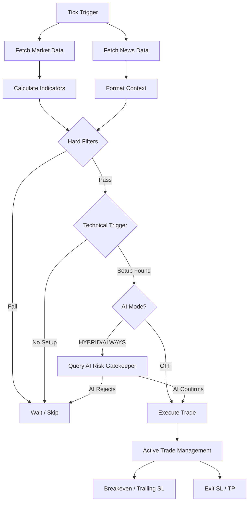

# 🤖 Forex Scalping Bot — IC Markets Edition
Local Ollama AI + IC Markets cTrader Open API | Pure Forex

---

## ⚙️ How it Works

The bot operates as a **semi-autonomous polling system** that bridges traditional technical analysis with modern local AI decision-making.

### Architecture Overview



1.  **Multi-Timeframe Data (`indicators.js`)**:
    Every minute, the bot fetches the latest "candles" (price action) for `EURUSD` on two timeframes: **M5** (for entry) and **M15** (for major trend context). It calculates **EMA (8 & 21)**, **RSI**, **ATR**, **Bollinger Bands**, **VWAP**, and **MACD**.

2.  **Short-Circuit Technical Filtering**:
    To reduce AI latency, the bot performs "Short-Circuit" checks *before* calling the AI. If technical rules (e.g., Price vs. VWAP, RSI extremes, or M15 Trend) or safety rules (e.g., 5-pip trade distance) are violated, the bot skips the AI call entirely, resulting in **0.0s latency** for invalid setups.

3.  **Local AI Orchestration (`ai.js`)**:
    If the technical setup is valid, the data is sent to a local **Ollama** model (like `llama3.2:3b`). The AI acts as the "Strategy Manager," returning a structured JSON signal (`BUY`, `SELL`, or `WAIT`) along with suggested Stop Loss (SL) and Take Profit (TP) levels.

4.  **Risk Management & Multi-Trade Execution**:
    - **Fixed 1% Risk**: Position size is calculated dynamically based on account balance and SL distance.
    - **Multi-Trade Support**: Allows up to 3 concurrent trades with a mandatory 5-pip price distance to prevent "stacking" risk.
    - **Automatic Reconciliation**: On startup, it syncs with IC Markets to "adopt" existing trades.
    - **Persistence**: Saves active trade IDs to `state.json` to survive crashes or restarts.

---

## 🚀 Roadmap: Areas for Improvement

Based on our recent backtests and live execution analysis, here are the primary points we can improve:

### 1. Execution Speed & Latency
- **Optimized Indicators**: Currently, we recalculate all indicators on every tick. Moving to a more efficient sliding-window approach or using a dedicated library like `technicalindicators` for performance.
- **AI Latency**: Even in `HYBRID` mode, a cloud-based AI (Claude) adds 5-15s latency. We could explore using quantized local models on a dedicated GPU to reduce this to <2s.

### 2. Advanced Market Sentiment
- **NLP Score**: Instead of just passing raw news headlines, we could pre-process news through a specialized NLP model to get a structured `-1.0 to 1.0` sentiment score for the AI to ingest.
- **Correlated Pairs**: Monitoring `DXY` (Dollar Index) or `GBPUSD` to detect broader USD strength/weakness, which often precedes `EURUSD` movement.

### 3. Backtest Realism
- **Slippage Simulation**: Current backtests assume perfect execution. Adding `0.2 - 0.5 pip` slippage would make the results more conservative and realistic.
- **Variable Spread**: Simulating spread widening during news releases or session rollovers to test the bot's resilience during high-volatility periods.

### 4. Scalability & Monitoring
- **Multi-Pair Support**: The current loop is designed for one pair at a time. Refactoring to monitor 5-10 pairs concurrently would increase the number of high-quality trade opportunities.
- **Web Dashboard**: A real-time web UI (e.g., using Next.js or a simple dashboard) to monitor active trades, P&L, and AI "reasoning" without tailing log files.

### 5. Data Persistence & Analytics
- **Database Migration**: Moving `history.json` and trade logs to a database (e.g., SQLite or PostgreSQL) for faster querying and better long-term performance tracking.
- **Post-Trade Analysis**: Automatically tagging trades with "AI Reason" and "Outcome" to identify which market conditions the bot excels in (and which it struggles with).

---

## Full Setup Guide (do these in order)

### Step 1 — Create a cTrader ID
1. Go to **https://id.ctrader.com** and sign up
2. This is separate from your IC Markets login — it's Spotware's universal ID

### Step 2 — Link IC Markets to your cTrader ID
1. Go to **https://ct.icmarkets.com** (IC Markets cTrader web platform)
2. Log in using your cTrader ID
3. Your IC Markets trading account should appear automatically
4. Note your **account number** (top-left dropdown, 8–9 digits)

### Step 3 — Register an Open API Application
1. Go to **https://openapi.ctrader.com**
2. Log in with your cTrader ID
3. Click **Add new app**
4. Fill in a name (e.g. "Scalping Bot") and description
5. Submit — approval usually takes a few minutes
6. Once approved, click **Credentials** and copy:
   - **Client ID**
   - **Client Secret**

### Step 4 — Install Ollama (Local AI)
1. Download Ollama from **https://ollama.com**
2. Install and run it in the background
3. Pull the recommended model:
```bash
ollama pull llama3.2:3b
```

### Step 5 — Install dependencies
```bash
npm install
```

### Step 6 — Set environment variables
Create a `.env` file:
```
# AI Settings (Defaults to ollama and llama3.2:3b)
AI_PROVIDER=ollama
OLLAMA_MODEL=llama3.2:3b

# IC Markets Credentials
CTRADER_CLIENT_ID=your-client-id
CTRADER_CLIENT_SECRET=your-client-secret
CTRADER_ACCOUNT_ID=your-ic-markets-account-number
```

### Step 7 — Get your Access Token (one-time)
```bash
node auth.js
```
- A URL is printed → open it in your browser
- Log in with your cTrader ID and click Allow
- The token is printed in your terminal
- Add it to your `.env`:
```
CTRADER_ACCESS_TOKEN=your-access-token
```

### Step 8 — Get your Symbol IDs
```bash
node get-symbols.js
```
- Prints the correct symbol IDs for your IC Markets account
- Copy the output block into `config.js` → `ctraderSymbolIds`

### Step 9 — Configure News Filter (Required for Automation)
The bot provides real-time market sentiment to the AI via Finnhub market headlines.

1. Register for a free account at [finnhub.io](https://finnhub.io/).
2. Copy your **API Key**.
3. Add it to your `.env`:
   ```js
   NEWS_API_KEY=your-api-key
   NEWS_PROVIDER=finnhub
   ```
4. The bot now automatically connects to Finnhub via **WebSockets** for real-time headlines. (Note: Economic calendar check is disabled as it's a premium feature).

### Step 10 — Run the bot
```bash
# Monitor only — signals printed, no trades placed (START HERE)
npm start

# Auto-execute EUR/USD (High-Hardened Mode)
npm run auto

# Compare session modes side-by-side (ny_only vs all_windows)
npm run compare:modes
```

`compare:modes` also saves a timestamped snapshot in the project root:
`mode_compare_YYYY-MM-DD_HH-mm-ss.json`

Clean up old snapshots (keeps latest 30 by default):
```bash
npm run compare:modes:prune
```

Run compare + prune in one step:
```bash
npm run compare:modes:run
```

Optional retention override:
```bash
MODE_COMPARE_KEEP=50 npm run compare:modes:prune
node prune-mode-snapshots.js --keep 10 --dry-run
```

---

## 📊 Safety & Performance Features

| Feature | Benefit |
|---|---|
| **Short-Circuiting** | Skips AI request if technical setup is invalid (saves 5-15s). |
| **Hard HTF Filter** | Refuses to BUY if M15 trend is DOWN (prevents fake-outs). |
| **5-Pip Distance** | Prevents "stacking" multiple trades at the exact same price. |
| **Price Deviation (0.1%)** | Kills trade if AI hallucinates a price off by >10 pips. |
| **Reconciliation** | Bot automatically "finds" and manages trades after a restart. |
| **Dynamic Pip Value** | Professional risk calculation (1% risk) across any symbol. |

---

## Session Hours (when the bot trades)

| Session | UTC Hours | Quality |
|---|---|---|
| Default mode (`ny_only`) | 12:30–16:00 | ⭐ Best quality so far |
| Experimental (`ny_trimmed`) | 12:45–15:45 | 🧪 Slight edge trim for A/B testing |
| Alt mode (`all_windows`) | 07:00–10:00 + 12:30–16:00 | ✅ Higher trade count |
| Off hours | all other UTC times | ⚠️ Skipped |

Set mode with environment variable:
```bash
SESSION_WINDOW_MODE=ny_only npm run backtest
SESSION_WINDOW_MODE=ny_trimmed npm run backtest
SESSION_WINDOW_MODE=all_windows npm run backtest
```

Fine-tune risk-band filters:
```bash
MIN_RISK_PIPS=2 MAX_RISK_PIPS=15 npm run backtest:ny
```

Current defaults keep the original 2-pip minimum and add a modest 15-pip max-risk cap
to skip wider-stop setups that tend to block cleaner follow-up trades.

Post-loss cooldown (default: 1 candle):
```bash
COOLDOWN_CANDLES_AFTER_LOSS=1 npm run backtest:ny
COOLDOWN_CANDLES_AFTER_LOSS=0 npm run backtest:ny
```

Current default is a 1-candle cooldown after an `SL`, which tested better than both
no cooldown and a 2-candle cooldown in the current backtests.

---

## File Overview

| File | Purpose |
|---|---|
| `index.js` | Main loop — signal + execution |
| `icmarkets.js` | cTrader WebSocket API client |
| `indicators.js` | EMA, RSI, ATR, MACD calculations |
| `ai.js` | Local Ollama / Claude client bridge |
| `config.js` | Risk, filters, and AI settings |
| `state.json` | Persistent storage for active trades |
| `activity.log` | Full audit trail of signals and skips |

---

## ⚠️ Risk Warnings
- Always start on a **Demo** account for at least 48 hours.
- Default risk: **1% per trade** — do not increase.
- Token expires every ~30 days — re-run `node auth.js`.
- Scalping is high-risk — most retail traders lose money.
- This bot is experimental and provided for educational purposes.
